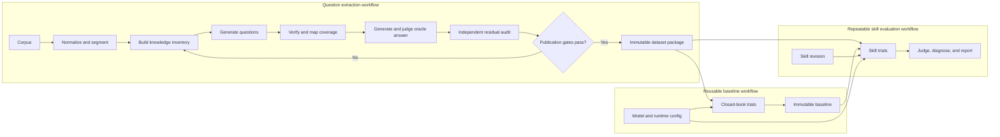

# Knowledge-grounded skill evaluation

## Goal

Build three separate workflows connected by immutable artifacts:

1. **Question extraction:** Given a knowledge corpus, produce and verify a reusable set of source-grounded questions.
2. **Baseline evaluation:** Given an existing question dataset and a model configuration, measure reusable closed-book behavior.
3. **Skill evaluation:** Given an existing question dataset, compatible baseline, and skill, measure how effectively the skill enables GitHub Copilot CLI to answer those questions.

Extraction runs once for a corpus revision and calibration configuration. Baseline evaluation runs once per evaluation configuration. Skill evaluation can then run any number of times against the immutable dataset and baseline with different skill revisions. Neither evaluation workflow invokes extraction implicitly, and skill evaluation never creates a baseline implicitly.

The first version assumes that the skill is responsible for the full corpus. It adapts the Knowledge Compressor article's open-book quiz method: extract questions from the source, prove that each can be answered from the source in a fresh context, and use the surviving questions as semantic tests.

## Inputs and outputs

Question extraction:

- Input: A corpus of Markdown files and an extraction configuration.
- Output: An immutable dataset package containing questions, rubrics, source documents, evidence mappings, and an extraction manifest.

Skill evaluation:

- Input: A dataset package, a skill directory containing `SKILL.md`, and an evaluation configuration.
- Output: Raw plain-text answers, execution metadata, and a report covering accuracy, skill uplift, coverage, and latency.

## Architecture



The dataset package is the only handoff between the workflows. It contains immutable copies of the normalized source documents, which are the sole ground truth, plus build-time oracle answers and judgments that prove every retained question works with the configured pipeline.

All model-backed stages run through persistent Copilot SDK clients backed by Copilot CLI. Each invocation is a new non-interactive session using the model configured for that workflow.

Independent sections, questions, trials, judgments, and diagnostics run concurrently through one shared limiter. The default concurrency is 10 and callers may set any positive value. Dataset builds admit at most that many sections at a time in corpus order, so admitted sections run through inventory, generation, and calibration and finish steadily instead of every section's stages interleaving. Baseline and skill evaluation treat each question and trial as an end-to-end scheduling pipeline: one slot generates an answer and then judges it. A bounded rolling window keeps one question's worth of pipelines ready beyond the active slots, immediately replaces completed pipelines while runnable work remains, and admits each diagnosis as soon as its skill question is judged. No new pipeline enters the window after a detected failure. Answer and judgment outputs remain separate SQLite checkpoints, so recovery can reuse either completed stage. Resume selects the latest matching incomplete operation and reuses completed jobs by semantic input hash, including jobs from an interrupted fresh attempt. Final datasets, baselines, and runs remain immutable JSON/JSONL packages.

Prompts that share a long source document put the static instructions and the document first and the question-specific text last (oracle, calibration judge, evaluation judge), so every call over the same document shares one cacheable prefix. The three independent calibration judgments run in parallel; the two tie-break judgments run only when they disagree.

Every command reports progress through one renderer abstraction. Human mode
maintains one stable, sparse TTY display with a single job-level measure,
current action, elapsed time, and an estimated time remaining once measurable
work has completed. Incomplete percentages round down, reserving 100% for
completion, and an expired estimate becomes explicitly uncertain. Dataset progress measures calibrated coverage over the
growing discovered knowledge inventory, but estimates time from completed Copilot calls: once a round of calls completes, remaining calls are predicted from inventoried items per source character and calls per item learned from finished sections. Baseline progress measures completed closed-book questions. Skill evaluation progress measures fully
evaluated questions after skill trials and any diagnosis finish. Human completion blocks contain concise
results and one artifact location, while operation IDs, journal paths, and raw
workspace names stay hidden. Agent mode emits bounded structured snapshots plus
immediate checkpoints, retries, and failures. JSON mode emits each complete
structured event on stderr; quiet mode emits none. Auto selects human output for
a TTY and agent output otherwise. Final results remain the only stdout contract.
The read-only `operation status` command queries a retained journal and returns
operation health (`running`, `interrupted`, `failed`, `completed`), per-stage job
counts, failed and running jobs by human label, throughput, an ETA, and remedies.
`operation wait` blocks until the next event and `operation recover` frees leases
held by dead processes. Long-running commands mirror the same state to
`<work-dir>/progress.json` and `<work-dir>/events.jsonl`, and `--detach` runs them as
independent processes. Dataset events carry a flat `metrics` object (sections done,
running, failed, stage mix, items, questions, calls) that agent lines print verbatim;
lines repeat only when something changed, with a slower heartbeat otherwise.

## Reliability and recovery

The operation journal (SQLite, WAL) is the recovery contract for every workflow.

**Identity versus budget.** An operation is identified by the inputs that change
results: corpus revision, pipeline version, models, reasoning effort, clean-pass
count and importance tiers. Budgets and runtime knobs (maximum residual, audit and
generation passes, timeouts, concurrency, Copilot CLI patch version) are recorded in
the operation's config but never identify it, so raising a budget resumes the same
operation and repeats only the jobs that failed. A job's own input hash covers its
source section and document revision. An operation may also declare a cache scope
(the result-affecting settings without the corpus); completed jobs with the same
scope, stage, entity and input hash are reused across operations, so unchanged
documents are not regenerated after an edit elsewhere in the corpus. Evaluation
operations declare no scope because their identity already includes the skill hash.

**Failure isolation.** A failing section never aborts its siblings. The build reports
each failure immediately with a human label (`file › heading path (lines a–b)`),
finishes every other section, and then fails once with exit code 3, the failed labels
and per-pass history, and `<work-dir>/failures/<operation>.json`, plus a per-section transcript (`failures/<operation>/<section>.jsonl`: every prompt and answer, each clipped to 30,000 characters, kept in memory per in-flight section and written only on failure). Publication stays
all-or-nothing: the 100% coverage gate is what makes dataset scores meaningful, so a
dataset that silently omits its hardest sections is never produced. A circuit breaker
aborts the run when Copilot calls fail repeatedly before any section finishes.

**Escalation.** A section that keeps finding new inventory gets twice the residual
pass budget once, then is split in half at a paragraph break (up to two levels) and
each part is inventoried independently; the merged output keeps the parent section's
provenance. Convergence is made reachable rather than only extended: residual prompts
show the source quote each existing item covers, restatements of an item on the same
passage (same span, similar statement) do not count as new, and low-importance
leftovers after the second pass are accepted as diminishing returns. Question
generation has its own bounded retry budget so an unanswerable item fails visibly
instead of looping. Calibration scores are rounded to nine decimals so rubric weights
that sum to one only approximately cannot turn a perfect answer into 0.9999999999999999.

**Leases.** A claimed job holds a 90-second lease renewed by a heartbeat every 30
seconds and records its owner's pid and host. A claim succeeds when the job is
pending or failed, when its lease expired, or when the owner is a dead process on the
same host. `SIGINT` and `SIGTERM` return claimed jobs to pending and release the
operation lock before the process exits. A run that meets a live owner waits for it
with a visible message instead of failing at the end. Each operation also has a lock
with a heartbeat, so two live processes cannot run it concurrently (exit code 4);
a dead or silent owner is replaced.

## Configuration

Extraction, baseline evaluation, and skill evaluation have separate CLI options. Baseline and skill evaluation inherit the dataset's model settings when callers omit them, but may use another model configuration without rebuilding the dataset. The closed-book baseline defaults to one trial per question (it is near-deterministic and was the largest avoidable cost) and skill evaluation to three. A skill run resolves the latest baseline matching its dataset ID, subject model, judge model, reasoning effort, evaluator version, and Copilot CLI version, and accepts any baseline with at least one trial per question; uplift compares per-question means. Evaluation never modifies a dataset or baseline in place.

```sh
skillfid dataset build \
  --corpus ./examples/arbor/corpus \
  --model gpt-5.6-sol \
  --reasoning-effort medium
```

```sh
skillfid eval run \
  --dataset ./datasets/<dataset-id> \
  --skill ./examples/arbor/skill \
  --trials 3
```

The extraction manifest records its resolved configuration, Copilot CLI version, model, corpus hash, prompts, and extractor version. Each evaluation run records the dataset ID, skill hash, resolved evaluation configuration, Copilot CLI version, model, prompts, and evaluator version. Neither workflow silently falls back to another model.

## Pipeline

### 1. Normalize the corpus

Convert every source into a common document form:

```json
{
  "documentId": "stable-id",
  "revision": "sha256:...",
  "title": "Source title",
  "content": "Normalized text",
  "metadata": {}
}
```

Split documents along headings (ignoring `#` lines inside fenced code blocks), then by a maximum size (`--max-section-chars`, default 12,000), preserving tables, code blocks, headings, and source offsets. Adjacent small sections are merged into one inventory unit up to `--min-section-chars` (default 1,500) but never across a chapter-level (`#`/`##`) heading, except that a heading with almost no text of its own always joins what follows; this removes the fixed per-section calls of tiny sections. Every section carries a human label (`file › heading path (lines a–b)`) used in progress, errors, and job names. A corpus may be a directory or a single file, filtered with `--include`/`--exclude` globs. Assign each passage a content hash so affected questions can be invalidated when the corpus changes.

### 2. Build the knowledge inventory

Before generating questions, extract an inventory of independently testable knowledge from every corpus section. Inventory items include facts, rules, procedures, constraints, exceptions, warnings, defaults, and relationships between items. Each item has a stable ID, exact source spans, an importance classification with rationale, and dependencies on other items.

```json
{
  "knowledgeId": "ki_01J...",
  "kind": "exception",
  "statement": "Personal charges must be excluded from reimbursement.",
  "importance": "high",
  "importanceReason": "Normative requirement",
  "evidenceIds": ["ev_01J..."],
  "dependsOn": []
}
```

Importance is derived from explicit document signals such as normative language, warnings, limits, prerequisites, and exceptions. Reviewers can override it. The inventory is the denominator for coverage; question count is not.

Run residual inventory passes in fresh Copilot CLI sessions. Each pass receives the section and current inventory (with the source quote each item covers) and may return only missing or incorrectly merged items; restatements of an existing item on the same passage are discarded as duplicates. Stop after a configured number of consecutive passes find no substantive additions (low-importance leftovers after the second pass count as diminishing returns), while recording the discovery curve in the audit record. See [Reliability and recovery](#reliability-and-recovery) for what happens when a section does not settle. `--profile quick|standard` and `--importance` limit publication to the selected importance tiers; the 100% coverage gate then applies to the selected tiers and the coverage report records them and the excluded count.

### 3. Generate candidate questions

Generate questions from inventory items, not directly from unconstrained corpus batches. A simple fact question may cover one item, while application and synthesis questions may cover several related items. Generate as many questions as needed for every accepted inventory item to be required by at least one validated rubric criterion. There is no question-count target.

Each candidate contains:

- The question.
- Exact supporting source spans.
- A grading rubric.
- The knowledge item IDs exercised by each rubric criterion.
- A question type and estimated difficulty.

Generate a controlled mix:

- Fact retrieval: thresholds, names, constraints, or definitions.
- Procedure: ordered actions and required checks.
- Application: applying a rule to a small scenario.
- Synthesis: combining evidence from multiple passages.
- Conflict resolution: selecting current or higher-authority guidance.

Prefer corpus-specific, recent, or synthetic facts. Generic questions are often answerable from model memory and reveal little about the skill.

### 4. Verify against the corpus

Validate every candidate in a fresh Copilot CLI session that has access to the complete original source document, not the skill.

Check:

1. The complete source is sufficient to answer the question.
2. The cited source spans support each rubric item.
3. Passing the rubric requires the mapped knowledge items.
4. The wording has no answer leakage or material ambiguity.

Use deterministic validation for exact values, sets, and calculations where possible. Reject candidates that require outside knowledge.

### 5. Oracle-calibrate each question

Immediately after structural verification, answer each candidate once with the complete relevant source. Judge that fixed natural-language answer independently three times against the candidate rubric. Accept unanimous pass or fail verdicts. When the verdicts disagree, run two additional independent judgments; accept only a 4/5 supermajority and classify a 3/2 split as unstable. Retain only questions with a stable pass whose weighted criterion score is exactly 1. Regenerate or split failed and unstable candidates while their section inventory remains available.

Store the oracle answer, every criterion-level judgment, and the consensus result as calibration evidence, not as ground truth. Record the model, judge model, reasoning effort, Copilot CLI version, and consensus-policy version. Evaluation may reuse the calibration only when those settings match exactly.

### 6. Deduplicate and balance

Cluster questions by semantic similarity and shared evidence. Keep the clearest candidate from each cluster, then balance across documents, sections, question types, and difficulty.

Deduplication must preserve inventory coverage. A question can be removed only when its knowledge items remain covered by another retained question.

### 7. Audit completeness and publish

Run an independent audit in a fresh Copilot CLI session. The auditor receives the corpus, knowledge inventory, and question-to-knowledge matrix, then identifies:

- Missing inventory items.
- Important items without a retained question.
- Questions whose mapped item is not actually required to answer them.
- Untested relationships, exceptions, or multi-step procedures.

The extractor may publish a dataset only when:

- Every non-empty corpus section was inventoried or explicitly marked non-informational.
- Every accepted inventory item is required by at least one validated rubric criterion.
- Inventory coverage is 100% across every importance level and knowledge kind.
- The independent audit finds no unresolved high-importance omission.
- Every retained question passes answerability and evidence validation.
- Every retained question has a perfect oracle calibration.

Items may be excluded from the inventory only before publication, with a recorded reason showing that they are non-informational, duplicated, or not independently testable. An exclusion is not a coverage waiver and must be available for review.

Publication produces a coverage report containing section coverage, inventory coverage by importance and kind, synthesis coverage, exclusions, and residual discovery history. Any uncovered accepted inventory item blocks publication. These controls cannot prove semantic completeness, but they make omissions visible and prevent an apparently large question set from masking repeated coverage of the same facts.

## Dataset package

Publish extraction output under a content-addressed dataset ID. A package contains:

```text
datasets/<dataset-id>/
  manifest.json
  documents.jsonl
  knowledge.jsonl
  questions.jsonl
  evidence.jsonl
  calibrations.jsonl
  coverage.json
  audit.json
```

`manifest.json` identifies the corpus revision, extraction process, oracle calibration configuration, and judge-consensus policy. `documents.jsonl` stores immutable normalized source documents and is the sole answer authority. `knowledge.jsonl` is the complete inventory and defines the coverage denominator. `questions.jsonl` stores reusable tests without reference answers. `calibrations.jsonl` stores generated oracle answers, every independent criterion judgment, and their consensus as validation evidence. `coverage.json` stores coverage statistics, `audit.json` records independent findings and resolutions, and `evidence.jsonl` maps questions back to exact source excerpts. Store each test as:

```json
{
  "testId": "ke_01J...",
  "datasetId": "ds_01J...",
  "question": "A user stayed two nights. What should be itemized?",
  "rubric": [
    {
      "criterion": "Separates room tax",
      "weight": 0.4,
      "knowledgeItemIds": ["ki_01J...A"]
    },
    {
      "criterion": "Excludes personal charge",
      "weight": 0.6,
      "knowledgeItemIds": ["ki_01J...B"]
    }
  ],
  "evidence": [
    {
      "documentId": "travel-policy",
      "revision": "sha256:...",
      "start": 1204,
      "end": 1538,
      "quoteHash": "sha256:..."
    }
  ],
  "type": "application",
  "difficulty": "medium",
  "validators": {
    "answerability": 1.0,
    "agreement": 0.9
  }
}
```

Once published, a dataset package is read-only. Corpus changes or extraction changes produce a new dataset ID. Evaluation outputs live under separate run IDs and never modify the package.

## Copilot SDK runner

### Isolated workspaces

Create a separate workspace inside the run directory for every question, trial, and condition. Never reuse a subject or judge workspace across questions. Never run trials from the evaluator repository or the original corpus directory because Copilot could discover unrelated instructions, source files, or files written by an earlier trial.

- **Generation workspace:** Contains only the corpus batch and generation prompt.
- **Validation workspace:** Receives the complete relevant source in the validation prompt.
- **Closed-book workspace:** Contains no corpus and no skill.
- **Skill workspace:** Contains the skill under `.github/skills/<skill-name>/` and only the files distributed with that skill.
- **Oracle calibration workspace:** During dataset generation, receives the complete relevant source in the oracle prompt.

The skill condition must not receive the evaluator's original corpus unless that corpus is part of the skill itself. Otherwise the agent could answer by searching the source directly and bypass the behavior under test.

### Invocation

The Copilot SDK supports non-interactive prompts, explicit model selection, reasoning effort, working-directory isolation, and independent sessions. Subject and judge roles use separate long-lived clients. A subject trial follows this shape:

```js
const session = await client.createSession({
  workingDirectory: trialWorkspace,
  model,
  reasoningEffort,
  enableConfigDiscovery: false,
  enableSessionStore: false,
  memory: { enabled: false },
});
const response = await session.sendAndWait({ prompt: question }, timeoutMs);
```

The runner starts each SDK client once and multiplexes isolated sessions over its CLI server. It captures the assistant's plain-text answer and duration. A timeout aborts the session; configured retries create a new session without restarting the client.

Session tool filters disable shell execution, file writes, and URL access while preserving local read access for skill instructions and references. Normal Copilot path checks and the isolated workspace further constrain file access.

Use a clean non-resumed Copilot session and a fresh filesystem workspace for every question, condition, and repetition. Memory, configuration discovery, and the cross-session store remain disabled. Explicit skill invocation is translated into SDK-native skill preloading; automatic mode leaves the project skill discoverable. Before a run, record the runtime version and inspect session skills; fail validation if an unexpected project skill is visible in an isolated workspace.

### Prompt contract

The subject prompt should contain only the user question and a minimal output instruction, for example:

```text
Answer the user's question. Use an available skill when relevant. Return only
the final answer and any citations needed to support it.

User question: {{question}}
```

Use the same user question in closed-book and skill trials so automatic skill discovery and activation are evaluated consistently. When `--skill-invocation explicit` is selected, prefix only the skill prompt with `/<discovered-project-skill-name>`. Record the resolved invocation mode in the run manifest.

## Evaluation conditions

Dataset generation proves that every retained question and rubric is supported by the source. Evaluation measures each positive question under two matched conditions executed in separate operations:

1. **Closed-book baseline:** Copilot CLI with no skill and no corpus.
2. **Skill condition:** Copilot CLI with the skill exactly as users receive it.

Treat stored oracle calibration as a dataset publication gate, not an evaluation condition or model-specific ceiling. Do not require evaluation models to match the extraction configuration.

Repeat each condition using the configured `trials_per_question`. Pin model and CLI settings across a compatible baseline and skill run.

Create an immutable closed-book baseline once per exact evaluation configuration. Automatically select the latest compatible baseline for skill evaluation, embed its records in the run artifacts, and fail with an actionable command when none exists. This allows one fixed dataset to compare models with different inherent knowledge without repeating unchanged inference for every skill revision.

Use source-assisted reruns only as unscored diagnostics when measured evidence cannot distinguish skill packaging, retrieval, or model application failures. Do not add a mandatory open-book condition.

## Judging and scoring

Read the evaluated skill's answer directly from stdout. The subject answer remains natural text and does not follow an evaluation schema.

Judge the answer in a separate Copilot CLI session using the configured `judge_model`. The judge receives:

- The question.
- Weighted rubric criteria and their mapped knowledge items.
- The complete relevant source documents as ground truth.
- The candidate answer.

The judge compares meaning rather than wording. It scores each rubric criterion from 0 to 1, identifies unsupported claims, and provides an evidence-based rationale. The judge does not receive private reasoning traces or results from other evaluation conditions.

Only the judge's final response must match a versioned JSON schema because the harness needs criterion scores to aggregate results:

```json
{
  "criterionResults": [
    {
      "criterionIndex": 0,
      "score": 1.0,
      "rationale": "The answer correctly separates room tax."
    }
  ],
  "unsupportedClaims": []
}
```

Validate criterion indexes, score ranges, and required fields. Retry malformed judge output a configured number of times, then mark the judgment as an error rather than guessing a score. The harness computes the weighted total deterministically from validated criterion scores; the judge does not choose the final aggregate score.

Score:

- Answer correctness against weighted rubric items.
- Evidence faithfulness and citation accuracy.
- Task completion, including required calculations or output shape.
- Latency, reported separately from quality.

The primary metric is skill uplift over the closed-book baseline:

$$
U = S_{skill} - S_{closed}
$$

Report aggregate results with confidence intervals, plus breakdowns by source document and question type. Also report the percentage of corpus sections represented by at least one retained question.

## Traces, staging, and statistics

The Copilot SDK runner subscribes to each session's events and attaches a `trace` to every answer: whether a skill was loaded (`true`, `false`, or `null` for closed-book runs with no skills), which files were read with their sizes, tool calls, turns, and input, output and cached tokens. Unknown events are ignored so SDK additions never break an evaluation. Skill answers also carry progressive-disclosure metrics: files and bytes read and the fraction of the skill directory loaded; a trial that loads at least 90% of the skill's bytes across three or more files is flagged as having loaded everything.

Every skill trial below a perfect score is staged by a deterministic classifier before the model-based diagnosis, which receives the stage as context: `not_discovered` when the skill was available but never loaded; `false_refusal` when the answer refuses although the evidence is present in the skill; `retrieval_miss` when none of the files read contain the question's evidence (matched by normalized text, with a word-shingle fallback); `hallucination` when the judge reports unsupported claims; `application_error` when the evidence was read and the answer was still wrong. The earliest failing stage is the one to fix first.

Reports and summaries carry statistics, not just means: per-condition means and paired uplift with 95% confidence intervals over per-question means, a between-trial noise estimate, and per-question stability. `eval compare` pairs two runs per question and issues a verdict from the interval of the mean delta. Behavior probes (`--probes`) run unanswerable questions and author-defined behavior checks through the skill condition and are judged separately for refusal, hallucination, and each behavior; they never influence accuracy or uplift. Partial runs (`--sample`, `--filter`) and incremental runs (`--since`, which carries forward answers whose trace did not touch a changed skill file) are marked in manifests, summaries, and reports so they are never mistaken for full evaluations. Evaluation prompts, like dataset prompts, put static instructions and the source first and the case-specific input last.

## Failure diagnosis

When failure diagnosis is enabled, diagnose every test whose skill-condition average is below perfect. Diagnosis runs after scoring and does not change the evaluation score. Aggregate failed criteria, rationales, unsupported claims, and score variation across every measured trial; never select whichever trial happened to finish last.

Use the matched conditions and controlled reruns as a diagnostic ladder:

1. **Check the stored dataset calibration.** A published question must have a perfect calibration; a missing or imperfect calibration invalidates the dataset.
2. **Audit skill contents.** Compare the failed rubric's knowledge items and source evidence with the packaged skill. If the required knowledge is absent, incomplete, or contradictory, classify it as a skill knowledge gap.
3. **Force activation.** Rerun the question while explicitly requiring the target skill. If this passes, classify the original failure as skill activation or discoverability.
4. **Direct retrieval.** If the knowledge exists in the skill, rerun while directing Copilot to the relevant skill file or section. If this passes, classify the failure as skill navigation or retrieval.
5. **Analyze use of known evidence.** If Copilot still fails when directed to the relevant content but dataset calibration passed, compare the answer with the rubric to distinguish interpretation, application, and unsupported-grounding failures.

Diagnostic prompts may reveal the skill name, relevant files, or evidence because their outputs are explanatory and never included in the measured score. If evidence is insufficient to distinguish causes, record `unknown` instead of forcing a category.

Store one diagnosis record per failed test:

```json
{
  "runId": "run_01J...",
  "testId": "ke_01J...",
  "failedCriteria": [1],
  "criterionFailures": [{ "criterionIndex": 1, "averageScore": 0.67, "failedTrials": 2, "totalTrials": 3, "rationales": ["..."] }],
  "trialScores": [1, 0.5, 0.5],
  "category": "skill_knowledge_gap",
  "confidence": 0.94,
  "evidence": [
    "Stored dataset calibration passed.",
    "No skill file contains knowledge item ki_01J...B."
  ],
  "diagnosticReruns": [{ "kind": "directRetrieval", "answer": "...", "score": 1, "criterionResults": [], "unsupportedClaims": [] }],
  "fixTargets": [
    {
      "file": ".github/skills/expenses/references/hotels.md",
      "recommendation": "Add the missing personal-charge exclusion rule."
    }
  ]
}
```

Allowed categories are:

- `test_or_model_limitation`: Retained for defensive handling of invalid legacy data; schema v6 publication prevents this state.
- `skill_activation`: Explicitly requiring the skill fixes the answer.
- `skill_knowledge_gap`: Required knowledge is absent, incomplete, stale, or contradictory.
- `skill_retrieval`: Directing Copilot to existing skill content fixes the answer.
- `interpretation`: Relevant content is used but misunderstood.
- `application`: The content is understood but applied incorrectly.
- `grounding`: The answer introduces unsupported claims.
- `answer_variability`: Skill-assisted trial scores differ and stronger evidence does not isolate another cause.
- `unknown`: Available evidence does not isolate a cause.

The report keeps measured outcomes separate from diagnosis. It reports skill uplift in percentage points, aggregate score ranges across trials, severity bands, and concrete fix targets only when a diagnosis names a file. Per-question evidence includes every original answer, its score and failed-criterion rationales, diagnosis evidence, rerun outcomes, and recommended fix targets. Recommendations remain proposals for review; the evaluator never edits the skill automatically.

## Quality controls

- Version generation, validation, subject, and judge prompts.
- Require 100% accepted-inventory coverage; do not use question count as a target.
- Require an independent residual audit before dataset publication.
- Create a closed-book baseline whenever the evaluation configuration changes.
- Invalidate questions when evidence hashes no longer match.
- Keep generation and evaluation workspaces separate.
- Never derive expected answers from the skill.
- Keep diagnostic reruns separate from scored trials.
- Record `unknown` when failure evidence is inconclusive.
- Sample passing and failing judgments for periodic human calibration.
- Keep a reviewed challenge set out of prompt and pipeline tuning.

## Suggested implementation

Use a dependency-free JavaScript CLI on Node.js 24 or later with:

- Plain records and strict JSON validators for records and reports.
- JSON manifests for lineage and content-addressed dataset verification.
- JSONL for portable dataset and run records.
- Separate `answers.jsonl`, `judgments.jsonl`, and `diagnoses.jsonl` run artifacts.
- `@github/copilot-sdk` clients backed by Copilot CLI.
- Content-addressed run directories inside the workspace.

Commands:

```text
skillfid dataset build --corpus ./corpus
skillfid dataset recalibrate --dataset ./datasets/<dataset-id>
skillfid dataset verify --dataset ./datasets/<dataset-id>
skillfid eval baseline --dataset ./datasets/<dataset-id>
skillfid eval run --dataset ./datasets/<dataset-id> --skill ./skill
skillfid eval report --run ./runs/<run-id> --dataset ./datasets/<dataset-id>
```

`dataset build` is the only command that reads the source corpus or generates questions. `dataset recalibrate` copies the published extraction records unchanged, regenerates each oracle answer once, reruns the independent judge consensus, and publishes a derived immutable dataset with source lineage. `eval baseline` measures and stores closed-book behavior for an exact model configuration. `eval run` accepts an existing dataset and compatible baseline, failing if either is missing or invalid; it never rebuilds them.
`eval report` joins a completed run with that immutable dataset and writes a self-contained static HTML report without making Copilot calls.

## MVP sequence

1. Build the extraction workflow to ingest and hash Markdown corpora.
2. Produce a stable knowledge inventory with residual extraction passes.
3. Generate questions mapped to inventory items, verify answerability, and oracle-calibrate each candidate.
4. Audit coverage and publish immutable datasets only after every oracle and coverage gate passes.
5. Build the independent baseline workflow to load and verify an existing dataset.
6. Run isolated Copilot CLI skill trials against a compatible reusable baseline without invoking extraction.
7. Judge answers, diagnose failures, and produce reports tied to both dataset ID and skill hash.

The first useful result is not a universal score for the skill. It is a reproducible measurement of how much the skill improves Copilot CLI's ability to answer questions grounded in a specific corpus with a specific model.