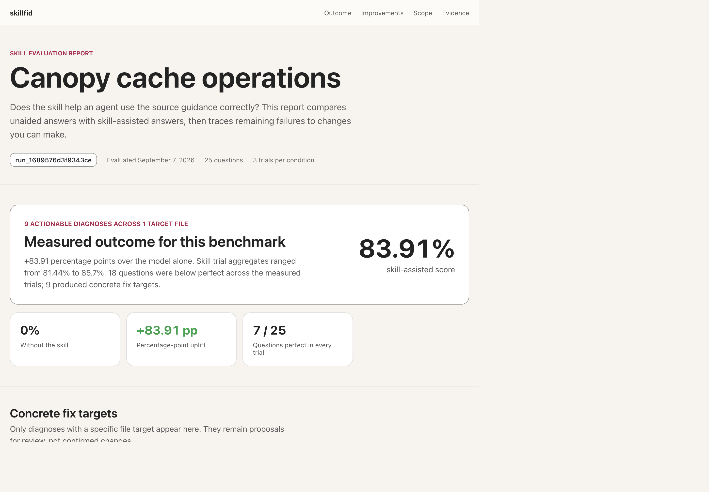

# skillfid

`skillfid` is a CLI for developers who build agent skills from documentation. It tests whether a skill helps an agent answer questions grounded in that source, revealing missing or imprecise guidance that reviewing the skill alone can miss. Use it to compare skill revisions against a reusable closed-book baseline and identify source-backed improvements.



## Requirements

- Node.js 24 or later
- GitHub Copilot CLI, authenticated for Copilot access

Check them with `node --version` and `copilot --version`. The default model for both
subject and judge is `gpt-5.6-sol`; override either per command.

## Installation

```sh
npm install --global skillfid
```

## Workflow

Run these steps in order. Steps 1-3 prepare reusable inputs; steps 4-5 repeat for
every revision of your skill.

| Step | Command | Run it | Produces |
| --- | --- | --- | --- |
| 1 | `dataset build` | Once per corpus | Immutable dataset of questions, evidence, and verified answers |
| 2 | `dataset verify` | Optional, after step 1 | Local integrity check of the dataset |
| 3 | `eval baseline` | Once per dataset and model configuration | Closed-book answers and judgments, without the skill |
| 4 | `eval run` | Every skill revision | Skill-assisted answers, scores, and diagnoses |
| 5 | `eval report` | After each run | Self-contained HTML report |

After step 5, read the diagnoses, improve the skill, and repeat steps 4 and 5.
Steps 1-3 stay unchanged, so every revision is compared against the same dataset and
baseline.

## Quick start

Commands below use the default output folders (`./datasets`, `./baselines`,
`./runs`). Each model-backed command prints the path it created; use it in the
next step.

### 1. Build a dataset

Point `skillfid` at a folder of Markdown files, the ground truth for your skill:

```sh
skillfid dataset build --corpus ./corpus
```

Every generated question must have an oracle answer that is judged perfect and
stable before the dataset is published. The result is `./datasets/<dataset-id>`.

```sh
DATASET=./datasets/<dataset-id>
```

### 2. Verify the dataset (optional)

```sh
skillfid dataset verify --dataset "$DATASET"
```

### 3. Measure the closed-book baseline

```sh
skillfid eval baseline --dataset "$DATASET"
```

This measures how well the agent answers without your skill. It is reused by every
later run.

### 4. Evaluate your skill

```sh
skillfid eval run --dataset "$DATASET" --skill ./path/to/skill
```

The run uses the latest baseline that exactly matches the dataset, models, reasoning
effort, trial count, evaluator version, and Copilot CLI version; otherwise it fails
with an actionable message. Set the output folder as `RUN`:

```sh
RUN=./runs/<run-id>
```

To invoke the skill as `/skill-name` in every skill prompt instead of relying on
automatic activation, add `--skill-invocation explicit`. This affects only the
skill condition.

### 5. Generate the report

```sh
skillfid eval report --run "$RUN" --dataset "$DATASET" --title "My skill"
```

The report is written to `$RUN/report.html`. Use `--output <file>` to change that.
This step is local and makes no Copilot calls.

### 6. Improve and repeat

Open the report, apply the recommended changes to your skill, then rerun steps 4
and 5. Compare scores across runs.

## Try it with Canopy

Canopy is a synthetic distributed build cache that demonstrates the complete
workflow. Inspect the included evaluation and trace its findings to the recorded
data without making a model call:

- [Open the self-contained HTML report](examples/canopy/runs/run_1689576d3f9343ce/report.html)
- Inspect the run's [summary](examples/canopy/runs/run_1689576d3f9343ce/summary.json), [diagnoses](examples/canopy/runs/run_1689576d3f9343ce/diagnoses.jsonl), and [recorded answers](examples/canopy/runs/run_1689576d3f9343ce/answers.jsonl)
- Trace findings through the [generated questions](examples/canopy/dataset/ds_7f1bc4dc92fc4b51/questions.jsonl), [evidence](examples/canopy/dataset/ds_7f1bc4dc92fc4b51/evidence.jsonl), and [source corpus](examples/canopy/corpus/cache-operations.md)
- Compare the intentionally compressed [original skill](examples/canopy/skill/SKILL.md) with the source-faithful [v2 skill](examples/canopy/skill-v2/SKILL.md)

The original skill scored **83.91%**, compared with **0%** closed book. After
source-backed improvements, v2 scored **100%** against the same dataset and
baseline. Both results used `gpt-5.6-sol` as subject and judge with three trials per
question. Scores are specific to the dataset and evaluation configuration.

To run the same workflow yourself, set `DATASET` and `RUN` to the paths printed by
the commands:

```sh
skillfid --progress human dataset build \
	--corpus ./examples/canopy/corpus \
	--output-dir ./.work/canopy/datasets \
	--work-dir ./.work/canopy/dataset-work

DATASET=./.work/canopy/datasets/<dataset-id>

skillfid --progress human eval baseline \
	--dataset "$DATASET" \
	--output-dir ./.work/canopy/baselines \
	--work-dir ./.work/canopy/baseline-work

skillfid --progress human eval run \
	--dataset "$DATASET" \
	--skill ./examples/canopy/skill \
	--baseline-dir ./.work/canopy/baselines \
	--skill-invocation explicit \
	--output-dir ./.work/canopy/runs \
	--work-dir ./.work/canopy/eval-work

RUN=./.work/canopy/runs/<run-id>

skillfid eval report \
	--run "$RUN" \
	--dataset "$DATASET" \
	--title "Canopy cache operations"
```

To evaluate the improved skill, rerun `eval run` with
`--skill ./examples/canopy/skill-v2`. See the
[Canopy walkthrough](examples/canopy/README.md) for the checked-in artifacts. For a
minimal model-backed smoke test, use the one-fact
[Arbor example](examples/arbor/README.md).

## Reference

Run `skillfid --help` for the complete command reference, including JSON schemas,
prerequisites, and exit codes. Add `--json` to any command for machine-readable
output. Primary output goes to stdout, while progress and errors go to stderr.

### Dataset calibration

Every generated question must produce an oracle answer that receives a stable,
perfect criterion-level judgment before publication. The same answer is judged
independently three times. Unanimous results are accepted; disagreement triggers
two more judgments, and only a 4/5 result is accepted. A 3/2 split is unstable and
blocks publication.

The dataset stores every judgment and its consensus in `calibrations.jsonl`; the
corpus remains the sole ground truth. Datasets older than schema v6 lack the combined
structural and integrity proof and must be rebuilt.

### Recalibrate a dataset

After changing the Copilot runtime, model, judge, or harness, recalibrate without
repeating corpus inventory or question extraction:

```sh
skillfid dataset recalibrate \
	--dataset ./datasets/<dataset-id> \
	--output-dir ./datasets
```

Recalibration copies documents, knowledge, evidence, questions, verification,
coverage, and audit records unchanged. It reruns only the oracle answer and
independent consensus judgments for each question. The oracle answer is generated
once and held fixed across all judge repeats. Every question must still receive a
stable, perfect calibration before publication.

The result is a new immutable dataset whose manifest records `sourceDatasetId`.
Continue interrupted recalibration with the same command and `--resume`. Rerun
steps 3-5 against the new dataset.

### Evaluation settings

- Oracle calibration is a dataset publication gate, not an evaluation condition or
  model-specific ceiling.
- Baseline and skill runs inherit model settings from the dataset by default;
  both commands may select another model configuration.
- Both commands default to three trials per question. Use `--trials <count>`
  consistently on both.
- When storing baselines outside `./baselines`, use matching `--output-dir` on
  `eval baseline` and `--baseline-dir` on `eval run`.
- `--skill-invocation auto|explicit` changes only the skill condition. The resolved
  mode is recorded in the run manifest; the baseline does not change.

### Execution and recovery

Copilot calls have a 600-second timeout and one fresh-session retry by default.
Configure them with `--timeout <seconds>` and `--timeout-retries <count>`.

Dataset builds and evaluations run independent work concurrently. The default
is 10; set `--concurrency <count>` to any positive integer. Answers and judgments
are separate recovery checkpoints, so interruption after answering does not
require generating that answer again.

Matching operations reuse completed work by default. Resume selects the latest
matching incomplete operation, including one originally started with `--fresh`.
Validated jobs are stored in
`<work-dir>/operations.sqlite` using SQLite WAL and retained after completion.

Use `--fresh` to start from scratch without deleting earlier state. When an
interactive operation is interrupted, the CLI prints the exact resume command, so
you do not need to reconstruct it.

Inspect retained operations without modifying the journal:

```sh
skillfid operation status --work-dir .work/eval --json
skillfid operation status --work-dir .work/eval --operation-id <id> --json
```

All commands support `--progress auto|human|agent|json|quiet`. Auto selects an
in-place display on a TTY and bounded agent snapshots otherwise. Human mode shows
current work and elapsed time, followed by an estimate and a compact result. JSON
progress is emitted as JSON Lines on stderr without changing final stdout.

### Artifacts and scoring

Each baseline stores its closed-book answers and judgments with an exact
compatibility manifest. Each skill run embeds those baseline records alongside
fresh skill answers. You will find the answers in `answers.jsonl`, criterion-level
judgments in `judgments.jsonl`, failure analysis in `diagnoses.jsonl`, and aggregate
scores in `summary.json`.

Embedding baseline records keeps reports self-contained without repeating closed-book
inference. The summary retains build-time calibration metadata for compatibility;
calibration is not an evaluation condition or model call.

HTML reports preserve that separation. Scores come from all recorded trials, and
uplift is shown in percentage points. Only diagnoses with concrete file targets
appear as recommended work; the evidence view retains every trial answer and its
failed-criterion rationale.

### Isolation and safety

Evaluation runs use an isolated repository-local profile and do not expose
authentication tokens to agent tools. Every question, trial, and condition runs in a fresh non-resumed Copilot SDK session
with its own filesystem workspace. Subject sessions share one client, and judge
sessions share another. Conversation and workspace state are not reused.

Evaluation calls deny shell execution, file writes, and URL access. This stops the
closed-book baseline from searching external sources while preserving local read
access for skill files. Service, authentication, and validation failures surface
immediately while completed journal checkpoints remain resumable.

See [DESIGN.md](DESIGN.md) for the architecture, scheduler behavior, and scoring
model.

## Development

Run the tests:

```sh
npm test
```

Ferryline is the synthetic distributed build-cache scenario from GitHub Next's
Knowledge Compressor article. Reproduce its calibration from a repository checkout;
the extraction script requires internet access to fetch the article:

```sh
npm run calibration:extract
npm start -- dataset build \
	--corpus .work/js-calibration/article/corpus \
	--output-dir .work/js-calibration/datasets \
	--json
npm run calibration:compare -- \
	.work/js-calibration/datasets/<dataset-id> \
	.work/js-calibration/article/reference-questions.json
```

## Support and contributing

Report defects and request features in
[GitHub Issues](https://github.com/waldekmastykarz/knowledge-eval/issues). Read
[CONTRIBUTING.md](CONTRIBUTING.md) before opening a pull request.

## License

Licensed under the [MIT License](LICENSE).